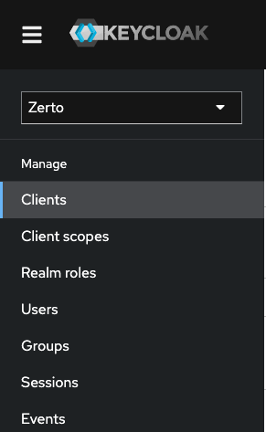
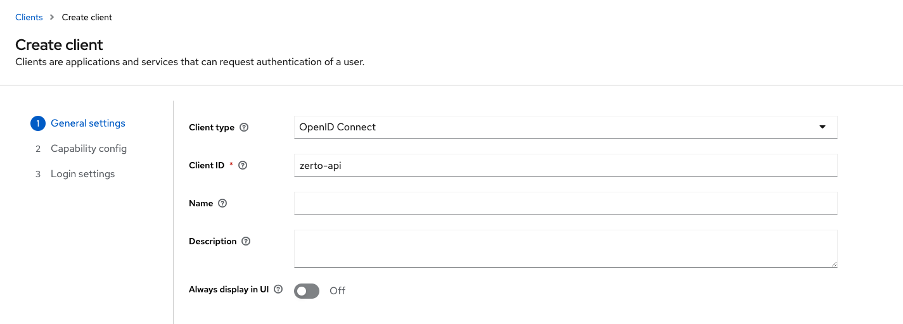
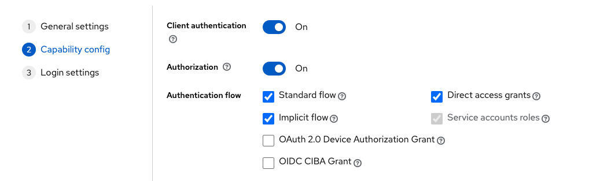

# Zerto VPG Checker

This project is designed to send alerts to a specified email address(s) when an event resulting in the following happen:

* The throughput for the entire ZVM is 0
* The throughput for a specific site is 0
* Enough VPGs are in a "down" state to surpass a threshold (default 90%)

This is meant to suppliment other reporting methods and should not be soley used to determine the health of a ZVM.

# Installation

This repository is designed to be installed on a Windows machine. If you are interested in installing this monitor on Linux or Mac, please see the 'Zerto-VPG-Checker-Linux' repository in this same account.

After everything has been installed, a new Windows service will be created under the name 'Zerto-Alerts'.

## Pre-Requisites

### ZVM Version

This monitor will only work on Zerto ZVM version 10.0 or higher. If your ZVM is running on Windows, this will not work. Please upgrade your ZVM environment before proceeding with the installation. You can find the information necessary to do this on Zerto's support site.

### Dependencies

The following must be installed on the target machine before proceeding:

* Python 3.10+
* Powershell

Please follow installation instructions for these before proceeding with installing this monitor. With the exception of these, the script automates downloading all other dependencies.

### Keycloak

Prior to installing this, you will need to create the needed credentials within Keycloak.
To access Keycloak, go to https://your-zvm-ip/auth and input the administrator user/password that was created when the ZVM appliance was first created.

Next, change the Realm in the top left to 'Zerto' and go to 'Clients'.



Create a client, and under 'Client ID' type 'zerto-api'.



Next, make sure that 'Client Authentication' and 'Authorization' are on, and 'Standard flow', 'Implicit flow', and 'Direct access grants' are all checked.



Leave the final page blank and click Save.

Find and click on the client you just created and click on the Credentials tab.
The client secret will be how the monitor connects to the ZVM's API. Please take note of this, and have it ready before you start the installation script.

This process will need to be repeated for every ZVM that you want this monitor to connect to.


### User Prompts

Before installation, you will need to have the following ready:

* The IP address(s) for the ZVMs you want to monitor
* The associated Keycloak Secret for the 'zerto-api' for each ZVM 

Once the pre-requisites have been installed, you may run the installation script with the following command in a powershell terminal:

```
powershell -ExecutionPolicy Bypass -File ./install.ps1
```

